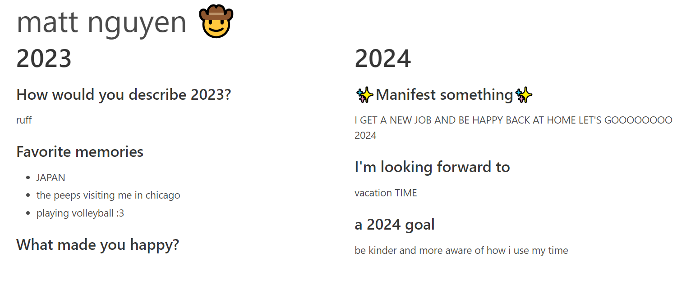

# Yearly Reflection

I made this project on a whim on the last day of the year in 2023, thinking it would be a good way for people to display it.

I didn't flesh this out fully since I wanted to move onto other things.

This is essentially just a glorified multi-step webform that displays the contents at the end.

I wrote this in Python since I was trying to make this quickly, but I think I should've written this in Javascript/Typescript to make it a SPA or something like that. 

Written in HTMX & Flask, the form's state is kept server-side. This makes for not great UX, as you can lose progress easily & it couples the logic of the frontend & backend.
